# 🏗️ Cloud Architecture Diagram Generator

## 프로젝트 개요

- **클라우드 도식화**에 관심이 많음
  - 이것저것 써봄 / 수동 / 자유도🔻/ 유료...
- AI 기반 클라우드 **아키텍처 다이어그램 자동 생성** 웹 애플리케이션
- 자연어 설명을 다이어그램으로 변환

## 프로젝트 링크

  <h3><a href="https://storage.googleapis.com/gleaming-modem-474701-f3-cloud-architecture-frontend/index.html">URL 링크 클릭</h3>
  

 
 
 

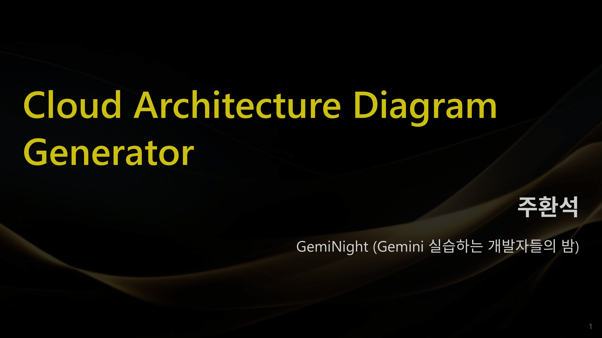
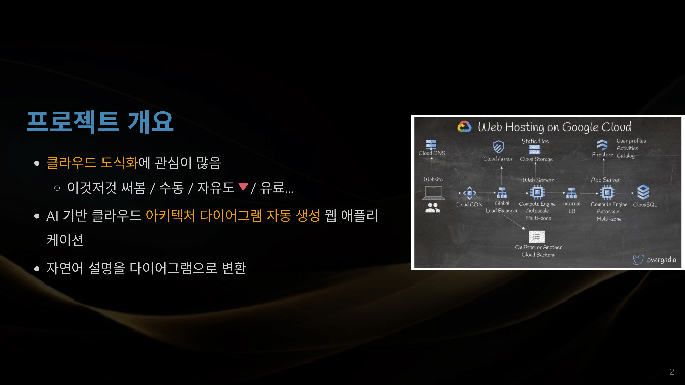
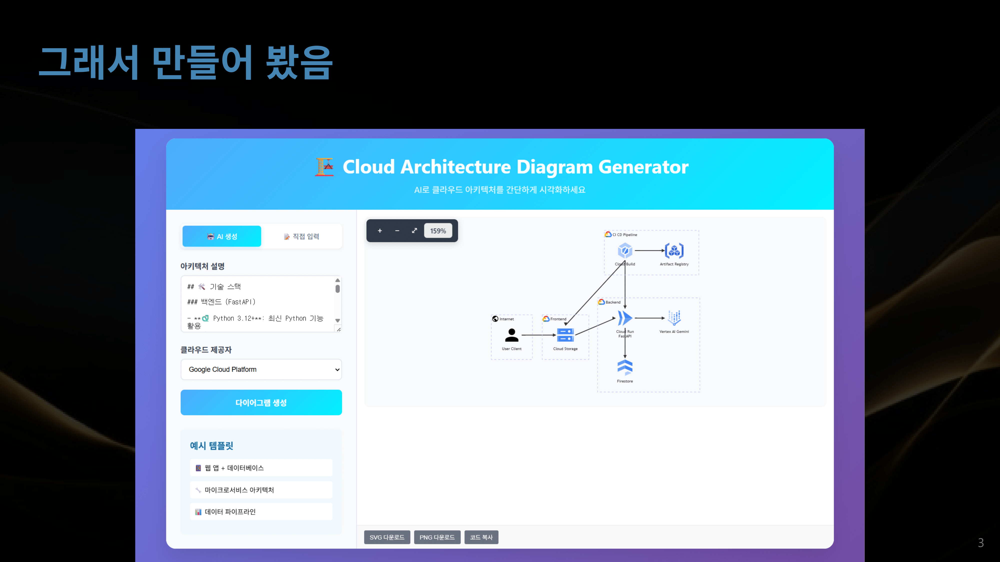
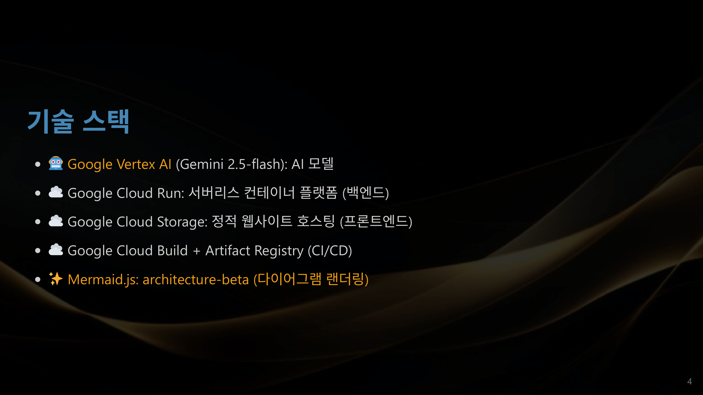
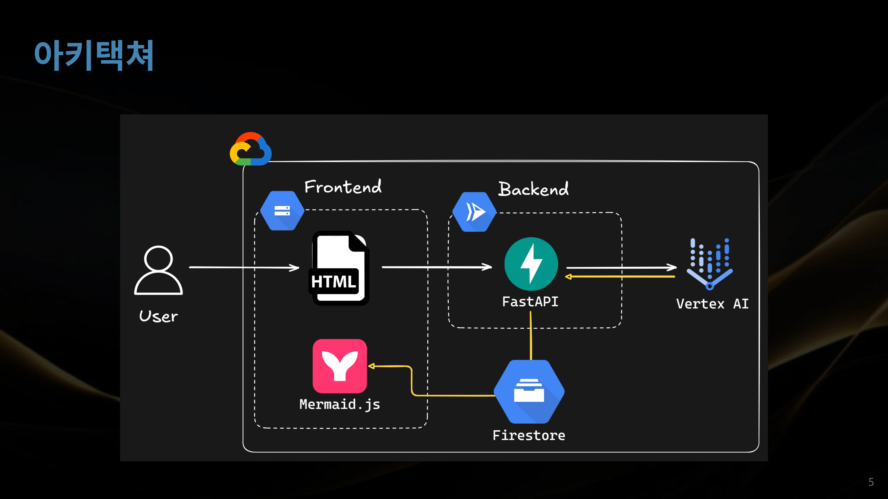
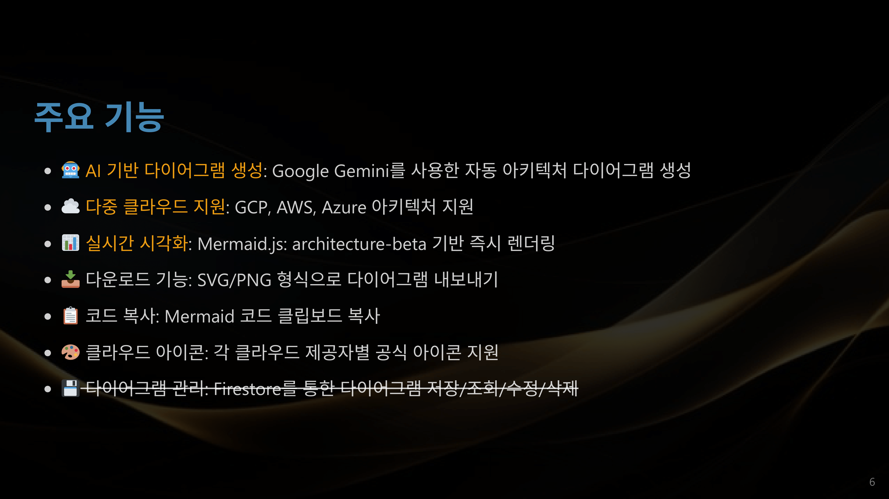
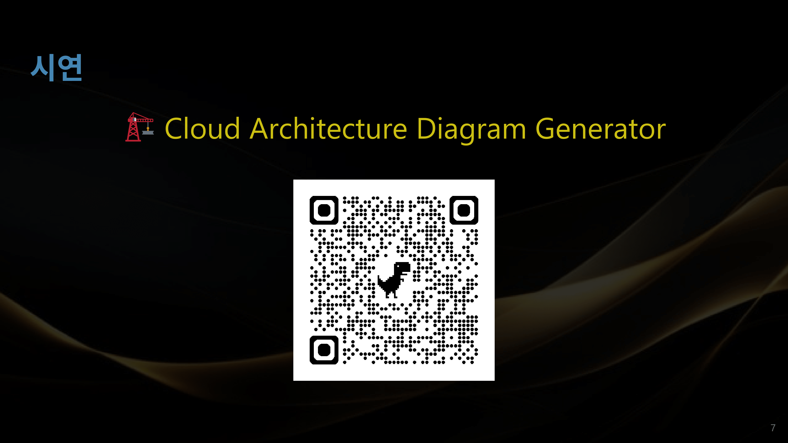
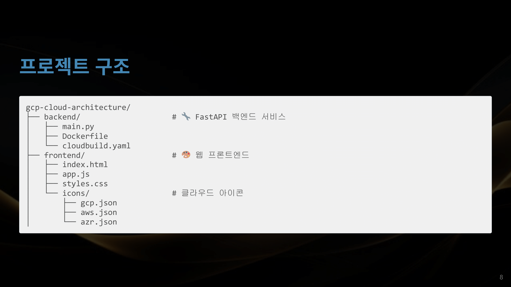
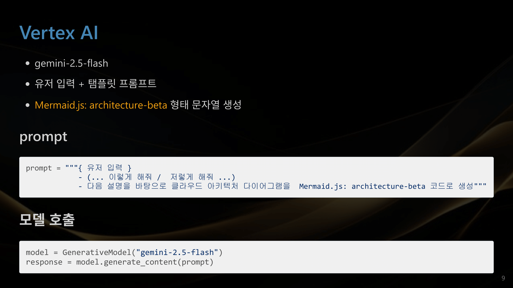
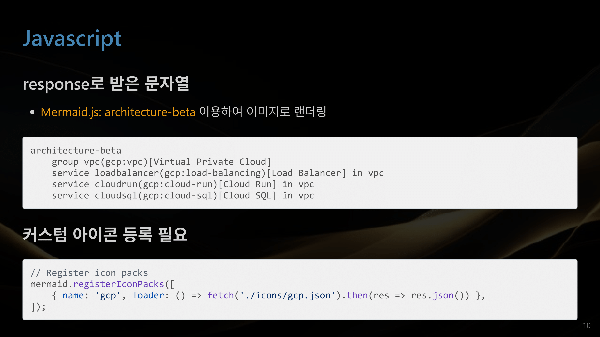
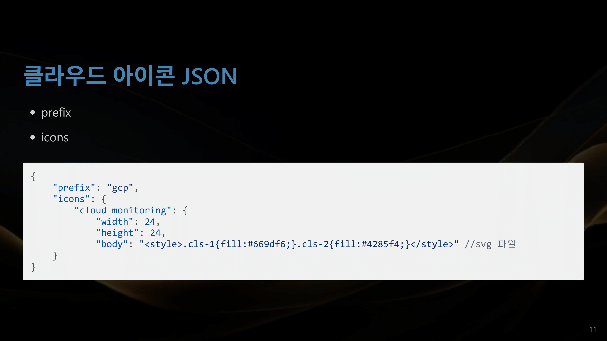
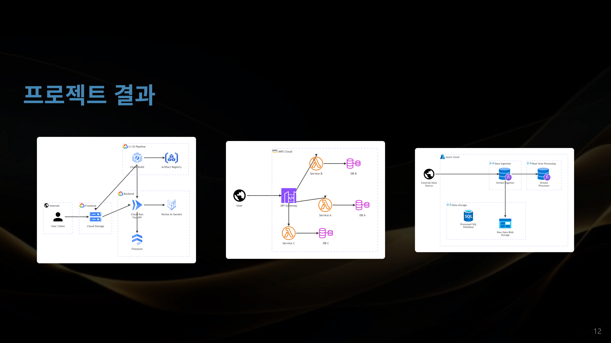
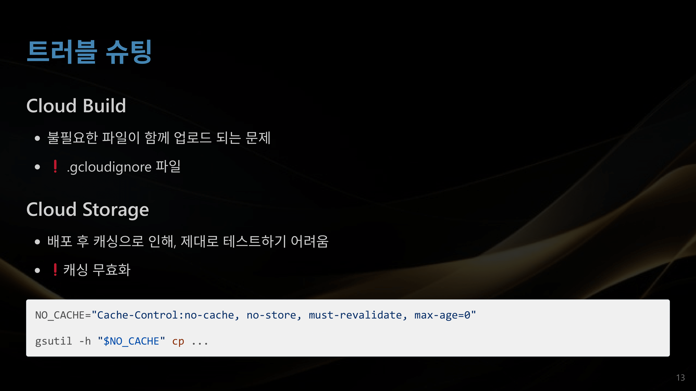
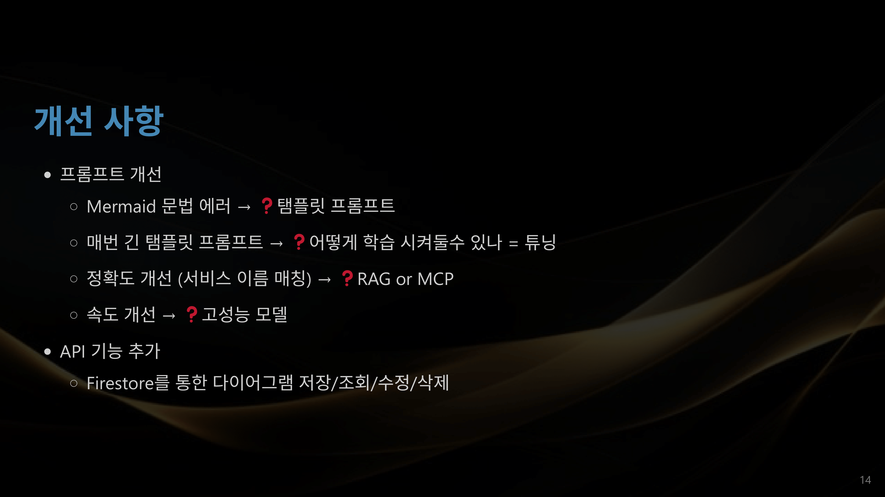

